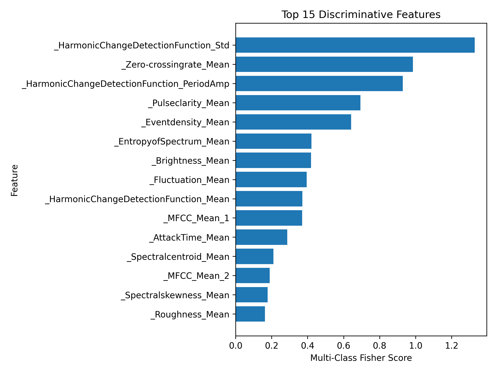
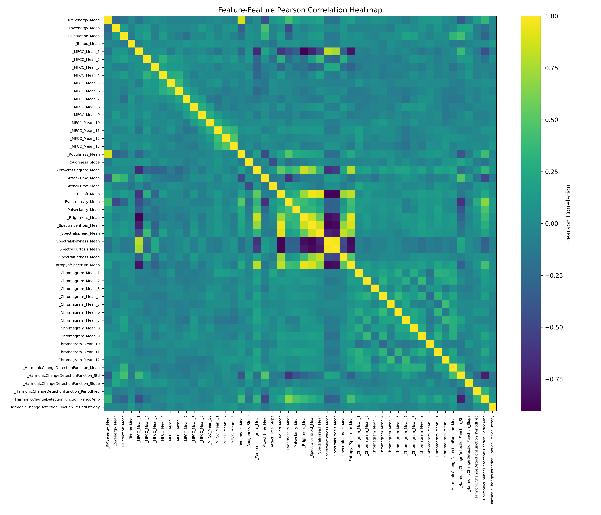
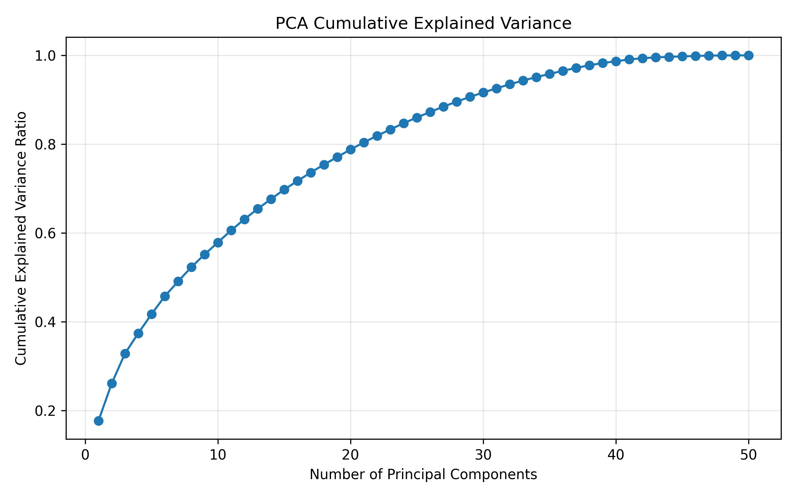
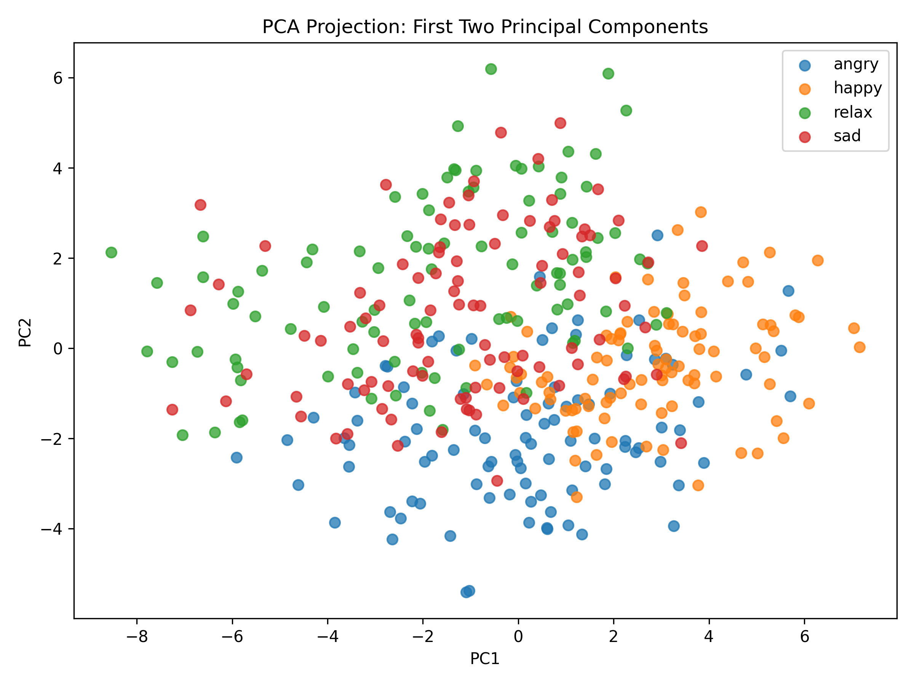
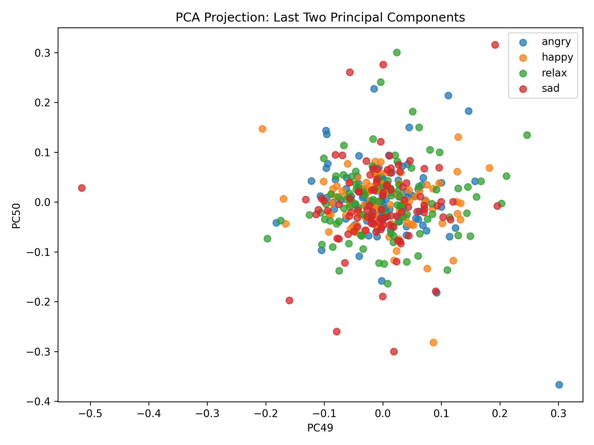
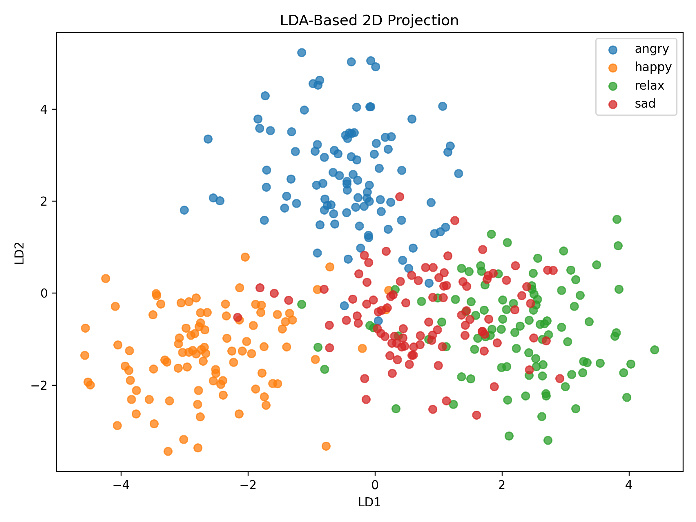
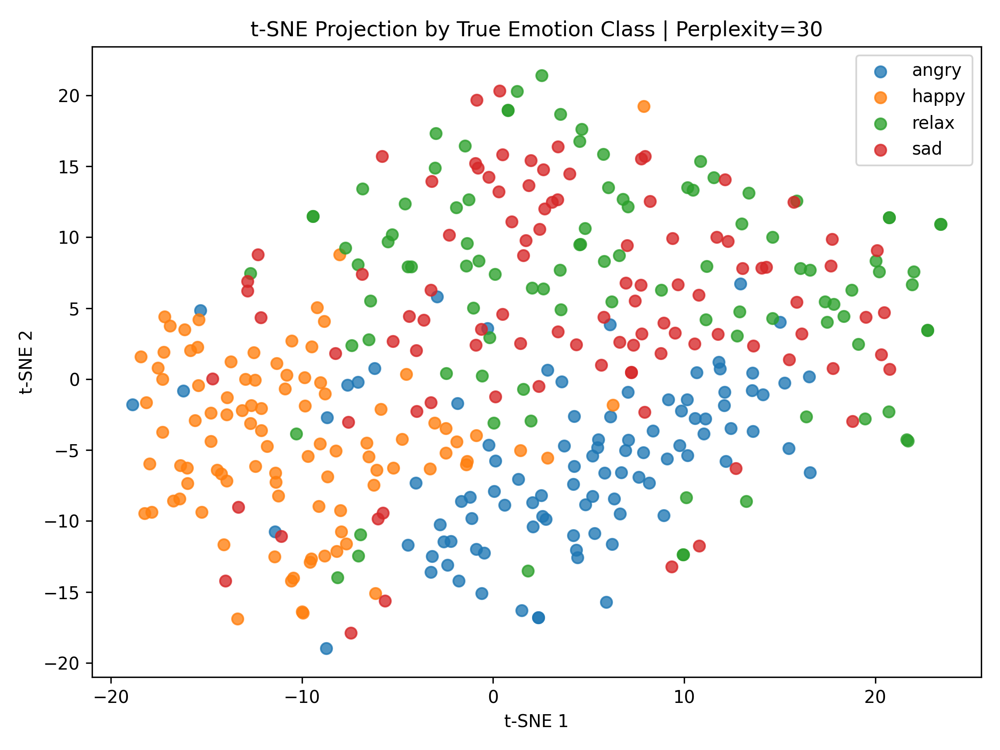
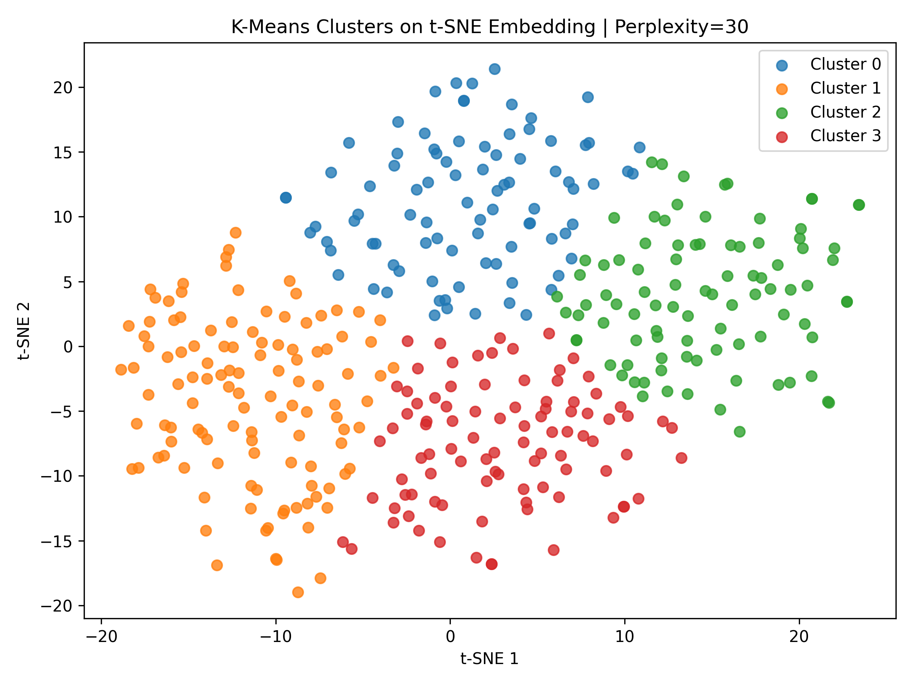

# Acoustic Feature-Based Statistical Separability Analysis of Turkish Music Emotion Classes

> Statistical analysis of Turkish music emotion classes using acoustic descriptors, Fisher-based discriminability, PCA, LDA, clustering, nonlinear mapping, SOM, and hypothesis testing.


---

## 1. Project Overview

This project investigates whether numerical acoustic descriptors can reveal meaningful separability among Turkish music emotion classes. The dataset contains four emotion labels: **angry**, **happy**, **relax**, and **sad**. The analysis focuses on statistical structure rather than only predictive modeling.

The workflow includes:

- Data quality assessment
- Duplicate detection and removal
- Outlier detection and IQR-based capping
- Z-score normalization
- Feature-feature correlation analysis
- Feature-class association analysis
- Fisher Score and pairwise Fisher Distance calculation
- Principal Component Analysis (PCA)
- Linear Discriminant Analysis (LDA)
- K-Means and DBSCAN clustering
- t-SNE nonlinear mapping
- Self-Organizing Map (SOM)
- Statistical hypothesis testing with Welch's t-test
- Repeated random sampling stability analysis

The main research question is:

> Can Turkish music emotion classes be statistically separated using acoustic features, and which features or projections reveal this separation most clearly?

---

## 2. Dataset

Dataset source: [Turkish Music Emotion Dataset on Kaggle](https://www.kaggle.com/datasets/blaler/turkish-music-emotion-dataset)

The raw dataset file used in this project is expected under:

```text
data/raw/Acoustic Features.csv
```

### Dataset Summary

| Property | Value |
|---|---:|
| Number of raw samples | 400 |
| Number of columns | 51 |
| Numerical features | 50 |
| Target column | `Class` |
| Number of emotion classes | 4 |
| Classes | angry, happy, relax, sad |
| Initial samples per class | 100 |
| Missing values | 0 |
| Duplicate rows | 12 |
| Rows after duplicate removal | 388 |
| Rows after IQR-based capping | 388 |
| Total capped feature values | 426 |

The dataset is balanced before preprocessing. After duplicate removal, the class distribution remains nearly balanced.

---

## 3. Repository Structure

```text
.
├── data/
│   ├── raw/
│   │   └── Acoustic Features.csv
│   ├── interim/
│   └── processed/
│
├── outputs/
│   ├── figures/
│   ├── tables/
│   └── text/
│
├── reports/
│
├── scripts/
│   ├── 01_data_quality.py
│   ├── 02_correlation_analysis.py
│   ├── 03_feature_discriminability.py
│   ├── 04_pca_analysis.py
│   ├── 05_lda_analysis.py
│   ├── 06_clustering_analysis.py
│   ├── 07_hypothesis_testing.py
│   ├── 08_manual_calculation_support.py
│   ├── 09_sensitivity_analysis.py
│   ├── 10_report_quality_figures.py
│   ├── 11_clustering_sensitivity.py
│   ├── 12_statistical_testing_enhanced.py
│   ├── 13_mathematical_support_tables.py
│   ├── 14_tsne_metric_correction.py
│   ├── 99_run_all.py
│   └── 99_run_stage2.py
│
├── src/
│   ├── common.py
│   └── advanced_common.py
│
├── README.md
├── requirements.txt
└── requirements_stage2.txt
```

---

## 4. Installation

Create and activate a virtual environment:

```bash
python -m venv myenv
```

Windows PowerShell:

```powershell
myenv\Scripts\activate
```

Install dependencies:

```bash
pip install -r requirements.txt
pip install -r requirements_stage2.txt
```

---

## 5. Running the Analysis

Run the full first-stage analysis:

```bash
python scripts/99_run_all.py --target Class
```

Run the second-stage extended analysis:

```bash
python scripts/99_run_stage2.py --target Class
```

Run the corrected t-SNE analysis:

```bash
python scripts/14_tsne_metric_correction.py --target Class
```

If the CSV path should be provided explicitly:

```bash
python scripts/99_run_all.py --csv "data/raw/Acoustic Features.csv" --target Class
python scripts/99_run_stage2.py --csv "data/raw/Acoustic Features.csv" --target Class
python scripts/14_tsne_metric_correction.py --csv "data/raw/Acoustic Features.csv" --target Class
```

---

## 6. Methodological Pipeline


If this image is not available, add a project workflow diagram named:

```text
outputs/figures/00_methodological_pipeline.png
```

Suggested pipeline:

```text
Raw Dataset
   ↓
Data Quality Assessment
   ↓
Duplicate Removal + IQR-Based Capping
   ↓
Z-score Normalization
   ↓
Correlation + Fisher Score Analysis
   ↓
PCA and LDA Projection Analysis
   ↓
K-Means, DBSCAN, t-SNE, SOM
   ↓
Hypothesis Testing and Stability Analysis
```

---

## 7. Mathematical Foundations

### 7.1 Z-score Normalization

All numerical features were standardized before distance-, variance-, or covariance-based methods.

$$
z_{ij} = \frac{x_{ij} - \mu_j}{\sigma_j}
$$

where:

| Symbol | Meaning |
|---|---|
| $x_{ij}$ | value of feature $j$ for sample $i$ |
| $\mu_j$ | mean of feature $j$ |
| $\sigma_j$ | standard deviation of feature $j$ |
| $z_{ij}$ | standardized value |

---

### 7.2 IQR-Based Outlier Capping

The interquartile range is calculated as:

$$
IQR = Q_3 - Q_1
$$

Lower and upper bounds:

$$
L = Q_1 - 1.5 \times IQR
$$

$$
U = Q_3 + 1.5 \times IQR
$$

Capping rule:

$$
x_{ij}^{cap} =
\begin{cases}
L, & x_{ij} < L \\
x_{ij}, & L \leq x_{ij} \leq U \\
U, & x_{ij} > U
\end{cases}
$$

IQR-based capping was preferred over row deletion because extreme acoustic feature values may correspond to musically meaningful characteristics rather than measurement errors.

---

### 7.3 Multi-Class Fisher Score

For a feature $j$, the multi-class Fisher Score is:

$$
J_j =
\frac{
\sum_{c=1}^{C} n_c(\mu_{cj} - \mu_j)^2
}
{
\sum_{c=1}^{C}\sum_{i:y_i=c}(x_{ij} - \mu_{cj})^2
}
$$

where:

| Symbol | Meaning |
|---|---|
| $J_j$ | Fisher Score of feature $j$ |
| $C$ | number of classes |
| $n_c$ | number of samples in class $c$ |
| $\mu_{cj}$ | mean of feature $j$ in class $c$ |
| $\mu_j$ | overall mean of feature $j$ |

A high Fisher Score indicates strong between-class separation and low within-class dispersion.

---

### 7.4 Principal Component Analysis

PCA is an unsupervised variance-preserving projection method. Given the standardized matrix $Z$, the covariance matrix is:

$$
S = \frac{1}{n-1}Z^T Z
$$

The eigenvalue problem is:

$$
S v_k = \lambda_k v_k
$$

Projection onto the $k$-th principal component:

$$
t_{ik} = z_i^T v_k
$$

Explained variance ratio:

$$
EVR_k = \frac{\lambda_k}{\sum_{r=1}^{p}\lambda_r}
$$

PCA maximizes total variance, but high variance does not necessarily imply strong class separability.

---

### 7.5 Linear Discriminant Analysis

LDA is a supervised projection method. It maximizes the ratio of between-class scatter to within-class scatter.

Within-class scatter:

$$
S_W =
\sum_{c=1}^{C}
\sum_{i:y_i=c}
(x_i - \mu_c)(x_i - \mu_c)^T
$$

Between-class scatter:

$$
S_B =
\sum_{c=1}^{C}
n_c(\mu_c - \mu)(\mu_c - \mu)^T
$$

LDA objective:

$$
J(w) = \frac{w^T S_B w}{w^T S_W w}
$$

Generalized eigenvalue problem:

$$
S_B w = \lambda S_W w
$$

Since the dataset has four classes, LDA can produce at most:

$$
C - 1 = 3
$$

linear discriminants.

---

### 7.6 K-Means

K-Means minimizes the within-cluster sum of squares:

$$
J =
\sum_{k=1}^{K}
\sum_{i \in C_k}
\|x_i - \mu_k\|^2
$$

Assignment step:

$$
c_i = \arg\min_k \|x_i - \mu_k\|^2
$$

Centroid update:

$$
\mu_k = \frac{1}{|C_k|}\sum_{i \in C_k}x_i
$$

In this project, K-Means was applied on the first two PCA components as required.

---

### 7.7 DBSCAN

The epsilon-neighborhood of a sample is:

$$
N_{\varepsilon}(x_i) = \{x_j \mid d(x_i, x_j) \leq \varepsilon\}
$$

A point is a core point if:

$$
|N_{\varepsilon}(x_i)| \geq MinPts
$$

DBSCAN was applied on the first two PCA components. It did not produce clusters strongly aligned with the true emotion labels.

---

### 7.8 t-SNE

t-SNE is a nonlinear embedding method, not a clustering algorithm. High-dimensional similarities are modeled as:

$$
p_{j|i} =
\frac{
\exp\left(-\frac{\|x_i-x_j\|^2}{2\sigma_i^2}\right)
}
{
\sum_{k \neq i}\exp\left(-\frac{\|x_i-x_k\|^2}{2\sigma_i^2}\right)
}
$$

Low-dimensional similarities are modeled as:

$$
q_{ij} =
\frac{(1 + \|y_i-y_j\|^2)^{-1}}
{\sum_{k \neq l}(1 + \|y_k-y_l\|^2)^{-1}}
$$

The objective is to minimize Kullback-Leibler divergence:

$$
KL(P||Q) = \sum_{i \neq j}p_{ij}\log\frac{p_{ij}}{q_{ij}}
$$

To obtain clustering metrics, K-Means was applied to the t-SNE embedding.

---

### 7.9 Self-Organizing Map

For each input vector, the Best Matching Unit is:

$$
b = \arg\min_v \|x_i - w_v\|
$$

Weight update rule:

$$
w_v(t+1) = w_v(t) + \alpha(t)h_{b,v}(t)(x_i - w_v(t))
$$

Gaussian neighborhood function:

$$
h_{b,v}(t) =
\exp\left(-\frac{\|r_b-r_v\|^2}{2\sigma(t)^2}\right)
$$

SOM was used to inspect topological organization of emotion-related structures in the standardized acoustic feature space.

---

### 7.10 Welch's t-test

The selected feature for hypothesis testing was:

```text
_HarmonicChangeDetectionFunction_Std
```

Selected class pair:

```text
angry vs relax
```

Hypotheses:

$$
H_0: \mu_{angry} = \mu_{relax}
$$

$$
H_1: \mu_{angry} \neq \mu_{relax}
$$

Welch t-statistic:

$$
t =
\frac{\bar{x}_1 - \bar{x}_2}
{\sqrt{\frac{s_1^2}{n_1} + \frac{s_2^2}{n_2}}}
$$

Cohen's $d$:

$$
d = \frac{\bar{x}_1 - \bar{x}_2}{s_p}
$$

---

## 8. Key Results

### 8.1 Feature Discriminability

The most discriminative features were identified using multi-class Fisher Score.

| Rank | Feature | Fisher Score |
|---:|---|---:|
| 1 | `_HarmonicChangeDetectionFunction_Std` | 1.328385 |
| 2 | `_Zero-crossingrate_Mean` | 0.985252 |
| 3 | `_HarmonicChangeDetectionFunction_PeriodAmp` | 0.929150 |
| 4 | `_Pulseclarity_Mean` | 0.693210 |
| 5 | `_Eventdensity_Mean` | 0.641541 |
| 6 | `_EntropyofSpectrum_Mean` | 0.421403 |
| 7 | `_Brightness_Mean` | 0.419163 |
| 8 | `_Fluctuation_Mean` | 0.394917 |

Interpretation:

> Emotion separability is mainly associated with harmonic change, zero-crossing behavior, rhythmic pulse, event density, and spectral structure.



---

### 8.2 Correlation Structure

Strong correlations were observed among spectral descriptors.

| Feature 1 | Feature 2 | Correlation |
|---|---|---:|
| `_Rolloff_Mean` | `_Spectralcentroid_Mean` | 0.9579 |
| `_Brightness_Mean` | `_EntropyofSpectrum_Mean` | 0.9319 |
| `_Rolloff_Mean` | `_Spectralspread_Mean` | 0.9209 |
| `_MFCC_Mean_1` | `_Brightness_Mean` | -0.9009 |
| `_Spectralcentroid_Mean` | `_EntropyofSpectrum_Mean` | 0.8894 |



Interpretation:

> The high correlations among spectral features are expected because these variables represent related aspects of the frequency distribution of musical audio signals.

---

### 8.3 PCA Results

| Component | Eigenvalue | Explained Variance Ratio | Cumulative Explained Variance | Fisher Score |
|---|---:|---:|---:|---:|
| PC1 | 8.877002 | 0.177082 | 0.177082 | 0.523273 |
| PC2 | 4.221322 | 0.084209 | 0.261291 | 0.651109 |
| PC3 | 3.379622 | 0.067418 | 0.328710 | 0.306725 |
| PC4 | 2.279596 | 0.045474 | 0.374184 | 0.029833 |
| PC5 | 2.158837 | 0.043065 | 0.417249 | 0.020257 |
| PC6 | 2.027086 | 0.040437 | 0.457687 | 0.141216 |







Interpretation:

> The first two principal components explain approximately 26.1% of the total variance. PCA reveals partial class structure, but considerable overlap remains because PCA does not use class labels.

---

### 8.4 PCA Eigenvalue-Fisher Relationship

| Component | Eigenvalue Rank | Fisher Rank |
|---|---:|---:|
| PC1 | 1 | 2 |
| PC2 | 2 | 1 |
| PC3 | 3 | 3 |
| PC6 | 6 | 4 |
| PC15 | 15 | 5 |


If the image does not appear, place the following figure at this location:

```text
outputs/figures/10_pca_eigenvalue_vs_fisher_score.png
```

Interpretation:

> Eigenvalue magnitude and Fisher Score are related for the first few principal components, but the relationship is not strictly monotonic. High explained variance does not always imply high class separability.

---

### 8.5 LDA Results

| Linear Discriminant | Explained Discriminant Variance Ratio | Cumulative Ratio |
|---|---:|---:|
| LD1 | 0.533340 | 0.533340 |
| LD2 | 0.378683 | 0.912023 |

| Class | LD1 | LD2 |
|---|---:|---:|
| angry | -0.448529 | 2.537403 |
| happy | -2.610210 | -1.271657 |
| relax | 2.223116 | -0.789578 |
| sad | 0.800462 | -0.484285 |



If unavailable, use:

```text
outputs/figures/04_lda_2d_projection_scatter.png
```

Interpretation:

> LDA provides much clearer class separation than PCA because it uses class labels to maximize between-class scatter and minimize within-class scatter. The first two LDA components capture approximately 91.2% of the discriminant variance.

---

### 8.6 PCA vs LDA Separability

| Embedding | Silhouette Score | Davies-Bouldin Score | Calinski-Harabasz Score |
|---|---:|---:|---:|
| PCA 2D | 0.037892 | 3.754672 | 71.968649 |
| LDA 2D | 0.306186 | 1.215227 | 346.499539 |

Interpretation:

> LDA outperforms PCA across all separability metrics. Higher Silhouette and Calinski-Harabasz scores, together with lower Davies-Bouldin score, indicate stronger class separation.

---

### 8.7 Clustering Results

#### K-Means on PCA 2D

| K | Inertia | ARI | NMI | Silhouette |
|---:|---:|---:|---:|---:|
| 2 | 2847.858 | 0.111408 | 0.145806 | 0.386035 |
| 3 | 1983.009 | 0.213398 | 0.257108 | 0.377780 |
| 4 | 1387.783 | 0.216690 | 0.266483 | 0.384544 |
| 5 | 1143.824 | 0.214531 | 0.275601 | 0.365124 |
| 6 | 993.604 | 0.177186 | 0.259664 | 0.340450 |

Interpretation:

> K-Means partially captures emotion-related structure, but the agreement with true labels remains moderate.

#### DBSCAN on PCA 2D

| eps | Min Samples | ARI | NMI | Clusters | Noise Points |
|---:|---:|---:|---:|---:|---:|
| 0.629574 | 5 | 0.004626 | 0.056470 | 4 | 74 |
| 0.738510 | 5 | 0.002182 | 0.049075 | 4 | 46 |
| 0.960761 | 5 | 0.007986 | 0.055559 | 2 | 14 |
| 1.025735 | 5 | 0.007564 | 0.055829 | 2 | 11 |
| 1.204255 | 5 | -0.000086 | 0.002721 | 1 | 7 |

Interpretation:

> DBSCAN does not reveal density-based clusters aligned with true emotion labels in PCA space.

---

### 8.8 t-SNE + K-Means

| Perplexity | ARI | NMI | Homogeneity | Completeness | V-measure | Cluster Silhouette |
|---:|---:|---:|---:|---:|---:|---:|
| 5 | 0.148831 | 0.188742 | 0.188576 | 0.188909 | 0.188742 | 0.404948 |
| 15 | 0.207996 | 0.236232 | 0.235794 | 0.236672 | 0.236232 | 0.374948 |
| 30 | 0.290140 | 0.312316 | 0.311674 | 0.312960 | 0.312316 | 0.397721 |
| 50 | 0.272602 | 0.313342 | 0.313267 | 0.313417 | 0.313342 | 0.401833 |





Interpretation:

> t-SNE followed by K-Means improves label agreement compared with K-Means on PCA 2D. This indicates that nonlinear neighborhood-preserving projection reveals additional local structure.

---

### 8.9 Hypothesis Testing

Selected feature:

```text
_HarmonicChangeDetectionFunction_Std
```

Selected class pair:

```text
angry vs relax
```

| Sample Size per Class | Welch t | p-value | Cohen's d | Decision |
|---:|---:|---:|---:|---|
| 36 | -12.223350 | 5.44e-19 | -2.881071 | Reject H0 |
| 64 | -15.363372 | 1.16e-30 | -2.715886 | Reject H0 |

Repeated sampling stability:

| Sample Size per Class | Repetitions | Rejection Rate | Median p-value | Mean Cohen's d |
|---:|---:|---:|---:|---:|
| 36 | 500 | 1.0 | 1.85e-17 | -2.708281 |
| 64 | 500 | 1.0 | 4.02e-30 | -2.695048 |

Interpretation:

> The null hypothesis is rejected for both sample sizes. The angry and relax classes show a statistically significant and practically large mean difference for `_HarmonicChangeDetectionFunction_Std`.

---

## 9. Main Findings

1. The dataset is balanced, complete, and suitable for multivariate statistical analysis.
2. Duplicate removal and IQR-based capping preserve the general class separability structure.
3. Harmonic change, zero-crossing rate, pulse clarity, event density, and spectral features are the most discriminative acoustic descriptors.
4. PCA captures dominant variance directions but provides limited class separation in two dimensions.
5. PCA eigenvalues and PCA-projected Fisher Scores are related but not equivalent.
6. LDA provides substantially better class separation than PCA.
7. K-Means partially captures emotion-related structure, while DBSCAN is weak for this dataset in PCA space.
8. t-SNE followed by K-Means improves clustering agreement compared with PCA-based K-Means.
9. The selected hypothesis test confirms a strong and stable statistical difference between angry and relax classes.

---

## 10. Conclusion

This project presents a statistical separability analysis of Turkish music emotion classes using 50 numerical acoustic features. The analysis demonstrates that emotion-related structure exists in the acoustic feature space, but it is not equally visible through all methods.

Fisher Score analysis shows that harmonic change, zero-crossing behavior, pulse clarity, event density, entropy of spectrum, brightness, and fluctuation-related features carry the strongest discriminative information. PCA reveals the dominant variance structure, but two-dimensional PCA projection shows substantial class overlap. LDA, by contrast, reveals much stronger class separation because it directly optimizes class separability.

Unsupervised clustering methods show mixed results. K-Means on PCA 2D provides partial alignment with true labels, DBSCAN does not detect emotion-aligned density clusters, and t-SNE followed by K-Means improves nonlinear structure discovery. The hypothesis testing results further support the statistical separability of selected emotion classes, especially between angry and relax samples based on harmonic change variability.

Overall, the results indicate that Turkish music emotion separability is mainly associated with harmonic, rhythmic, temporal, and spectral acoustic characteristics. The most effective visualization and separation method in this analysis is LDA, while Fisher Score provides a strong feature-level explanation of class discriminability.

---

## 11. References

- Turkish Music Emotion Dataset, Kaggle: https://www.kaggle.com/datasets/blaler/turkish-music-emotion-dataset
- Scikit-learn Documentation: https://scikit-learn.org/stable/
- MiniSom Repository: https://github.com/JustGlowing/minisom
- Fisher, R. A. (1936). The use of multiple measurements in taxonomic problems.
- Van der Maaten, L., & Hinton, G. (2008). Visualizing data using t-SNE.

---

## 12. Figure Asset Checklist

Place the following figure files under `outputs/figures/` for complete GitHub rendering:

```text
00_methodological_pipeline.png
01_boxplot_raw_features.png
01_boxplot_cleaned_features.png
02_feature_correlation_heatmap.png
03_top_fisher_features_barh.png
04_pca_cumulative_explained_variance.png
04_pca_first_two_components.png
04_pca_last_two_components.png
05_lda_2d_separability.png
10_pca_eigenvalue_vs_fisher_score.png
14_tsne_perplexity_30_true_classes.png
14_tsne_kmeans_perplexity_30.png
```

Optional but recommended:

```text
10_classwise_boxplots_top_fisher_features.png
10_pca_loading_heatmap_first_five_components.png
11_kmeans_elbow_plot.png
11_kmeans_silhouette_vs_k.png
11_dbscan_k_distance_plot.png
11_som_umatrix.png
11_som_class_hit_map.png
12_hypothesis_testing_boxplot.png
```

---

## 13. Reproducibility Notes

All scripts use fixed random states where stochastic algorithms are involved. This improves reproducibility for:

- K-Means
- t-SNE
- SOM
- random sampling in hypothesis testing

Due to the stochastic nature of t-SNE and SOM, small visual differences may occur if parameters, random seed, or library versions are changed.
